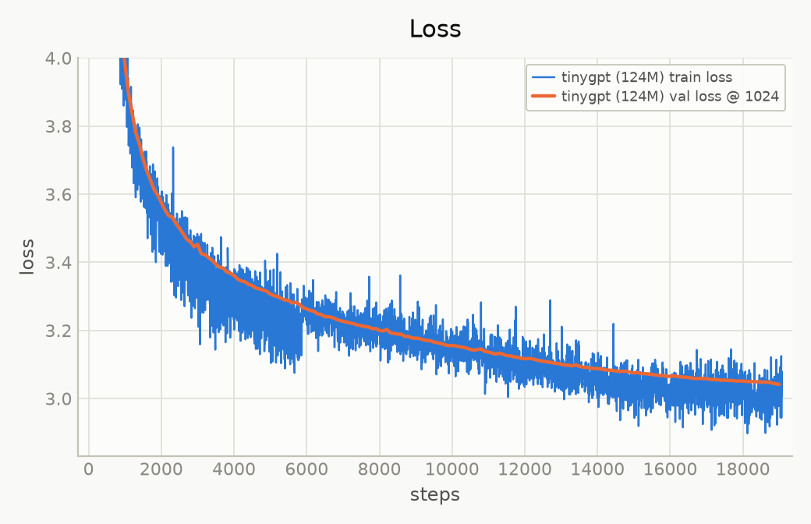
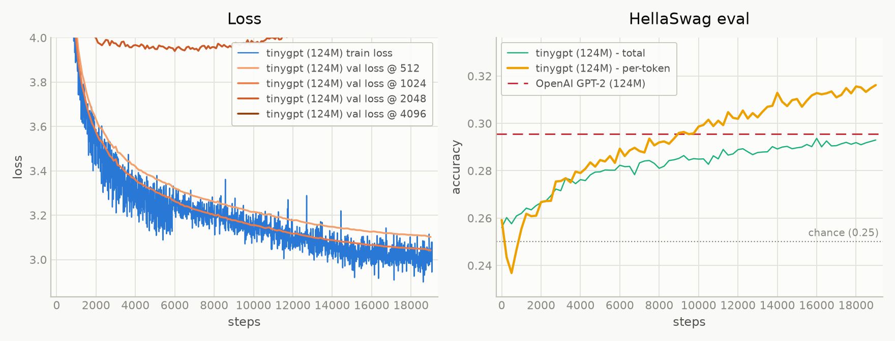
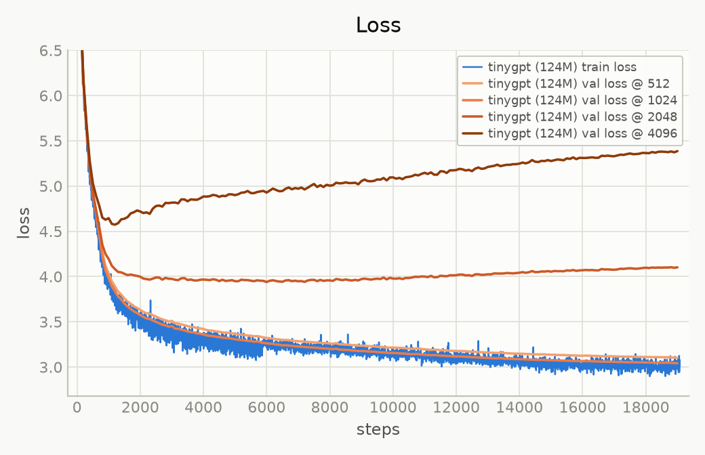

# tinyGPT

The simple repository for training medium-to-small size GPTs. 
Still under active development with more ground to cover (SFT, Inference, etc.)

Written from scratch in PyTorch, trained on 10B tokens of data, with Rotary Position Embeddings replacing the learned positional table and it reproduces (also surpasses) GPT-2 (124M), running on a single 4xA100 80GB node in about ~5 hours of training.
Its not a direct one to one match with the OpenAI GPT-2 eval since the training dataset is different but the performance on Hellaswag is better.

The implementation follows the GPT-2 and GPT-3 papers for architecture and training setup, and the RoFormer paper for the positional scheme. Everything — model, data pipeline, distributed training loop, and evaluation harness — is written here in simplistic manner rather than imported.

There are two training paths, one is the base path and another is the one with RoPE replacing learnable positional embeddings - both of these sit in different branches (its hard to manage & maybe we'll drop learnable positional embeddings permanently in future).

| | val loss @1024 | HellaSwag (per-token) |
|---|---|---|
| OpenAI GPT-2 124M (published checkpoint) | 3.2924 | 0.2955 |
| **tinygpt 124M + RoPE** | **3.0415** | **0.3162** |

Weights: [checkpoint](https://huggingface.co/baba-dev/tinygpt-rope/blob/main/checkpoint.pt) - roughly ~1.5GB



---

## Setup

```bash
git checkout rope  # run from *development* branch if non-RoPE version is required
pip install uv
uv sync
uv run python dataloader.py # loads + tokenize data
```

Training script (if on ddp):
```bash
uv run torchrun --standalone --nproc_per_node=4 train_gpt2.py
```

On mps/cpu:
```bash
uv run python train_gpt2.py 
```

Input data tokenizes with the GPT-2 BPE, and writes 100 shards of 100M `uint16` tokens each — shard 0 held out for validation, 99 for training. Documents are delimited with `<|endoftext|>` and packed contiguously.

#### Resume from a checkpoint:

In case of ddp:
```bash
uv run torchrun --standalone --nproc_per_node=4 train_gpt2.py --resume-from checkpoint.pt 
```

On mps/cpu:
```bash
uv run python train_gpt2.py --resume-from checkpoint.pt 
```

Checkpoints store model weights, optimizer state, CPU and CUDA RNG state, and the data loader's shard and position, so a resumed run continues on the same data at the same point in the schedule.

## Architecture

Standard GPT-2 124M: 12 layers, 12 heads, 768 embedding dim, 1024 training context, vocabulary padded from 50257 to 50304 for better tensor alignment.

The tokenizer used is a tiktoken implementation of GPT-2 tokenizer which is a general BPE (can be located in dataloader.py file)

#### RoPE (Rotary Position Embeddings)

tinyGPT implements RoPE which was not the part of original GPT-2 implementation, this helps in understanding how model can be made sequence length independent, build positional knowledge within self-attention and without flowing into the residual stream / pathways. Also the max block_size is capped to 5000 tokens which means the model can be evaluated on any length within this token.

Flash attention and proper DDP setup is done in order to maximise the GPU usability.

## Results



### Length extrapolation

RoPE is often described as extrapolating to unseen sequence lengths. It does not, at least not out of the box. Validation loss was measured at four context lengths throughout training, holding tokens-per-eval constant by scaling batch size inversely with sequence length:

| context length | val loss @ final |
|---| ---|
| 512 | 3.1018 |
| **1024** | **3.0415** |
| 2048 | 4.1018 |
| 4096 | 5.3863 |



Inside the training range the model behaves as expected — 1024 beats 512, since more context helps. Past it, loss *rises* as context grows, which is the signature of positional failure: nothing else explains a model getting worse when given more to condition on.

The gap also widens over training, as the model becomes more dependent on position, the positions it has never seen hurt it more.

This is the documented behaviour that we've tried to *reproduce* and it's the practical reason long-context models can't simply be run past their training window.

## ToDos
- Some kind of SFT (Supervised Fine Tuning) - at this level we can do FFT but will start with LoRA.
- Adding other evals - perplexity, etc.
- Experimenting with better inits
- KV Caching
- Batched inference and throughput measurement.
- vLLM
- Position interpolation

## References

- Radford et al., *Language Models are Unsupervised Multitask Learners* (GPT-2)
- Brown et al., *Language Models are Few-Shot Learners* (GPT-3) — training hyperparameters
- Su et al., *RoFormer: Enhanced Transformer with Rotary Position Embedding*
- Dao et al., *FlashAttention*
- Zellers et al., *HellaSwag: Can a Machine Really Finish Your Sentence?*
