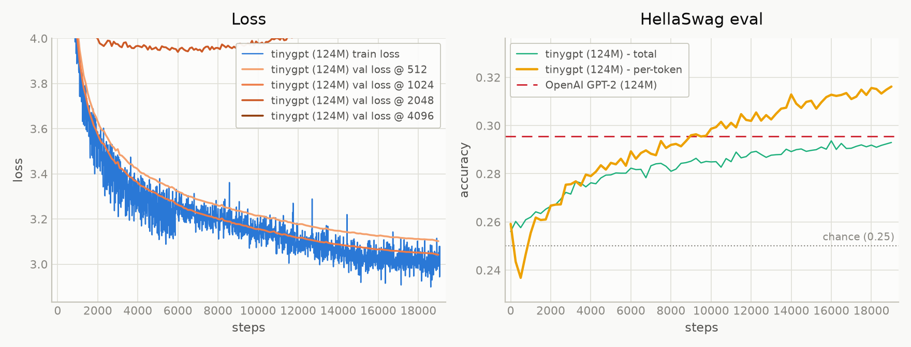
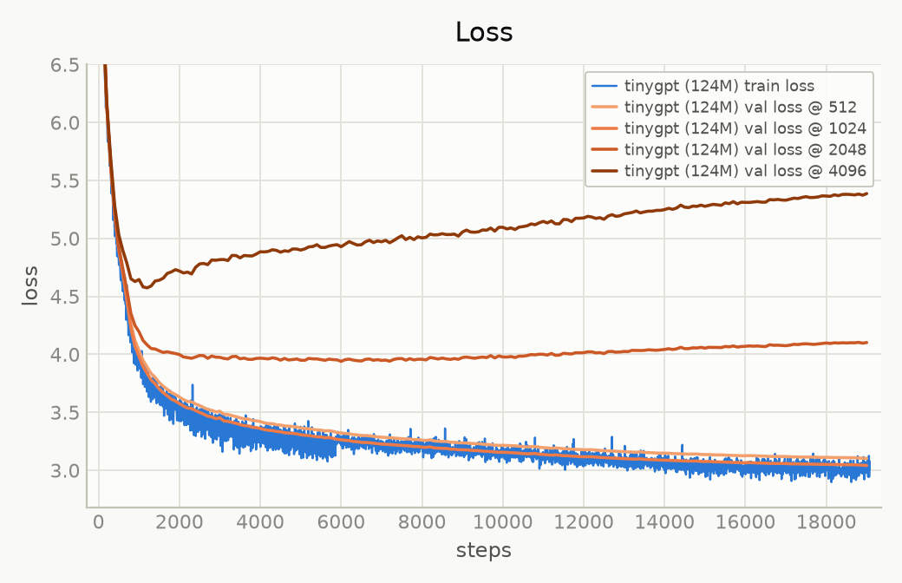
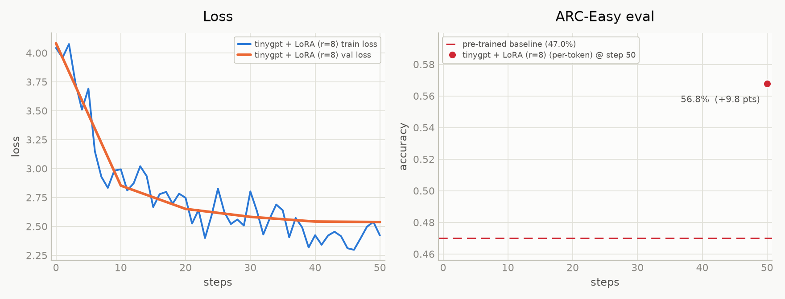

# tinyGPT

The simple repository for training medium-to-small size GPTs. 
Still under active development with more ground to cover (SFT, Inference, etc.)

Written from scratch in PyTorch, trained on 10B tokens of data, with Rotary Position Embeddings replacing the learned positional table and it reproduces (also surpasses) GPT-2 (124M), running on a single 4xA100 80GB node in about ~5 hours of training.
Its not a direct one to one match with the OpenAI GPT-2 eval since the training dataset is different but the performance on Hellaswag is better.

The implementation follows the GPT-2 and GPT-3 papers for architecture and training setup, and the RoFormer paper for the positional scheme. Everything — model, data pipeline, distributed training loop, and evaluation harness — is written here in simplistic manner rather than imported.

There are two training paths, one is the base path and another is the one with RoPE replacing learnable positional embeddings - both of these sit in different branches (its hard to manage & maybe we'll drop learnable positional embeddings permanently in future).

| | val loss @1024 | HellaSwag (per-token) |
|---|---|---|
| OpenAI GPT-2 124M (published checkpoint) | 3.2924 | 0.2955 |
| **tinygpt 124M + RoPE** | **3.0415** | **0.3162** |

Weights: [checkpoint](https://huggingface.co/baba-dev/tinygpt-rope/blob/main/checkpoint.pt) - roughly ~1.5GB


---

## Setup

```bash
git checkout rope  # run from *development* branch if non-RoPE version is required
pip install uv
uv sync
uv run python dataloader.py # loads + tokenize data
```

Training script (if on ddp):
```bash
uv run torchrun --standalone --nproc_per_node=4 train_gpt2.py
```

On mps/cpu:
```bash
uv run python train_gpt2.py 
```

Input data tokenizes with the GPT-2 BPE, and writes 100 shards of 100M `uint16` tokens each — shard 0 held out for validation, 99 for training. Documents are delimited with `<|endoftext|>` and packed contiguously.

#### Resume from a checkpoint:

In case of ddp:
```bash
uv run torchrun --standalone --nproc_per_node=4 train_gpt2.py --resume-from checkpoint.pt 
```

On mps/cpu:
```bash
uv run python train_gpt2.py --resume-from checkpoint.pt 
```

Checkpoints store model weights, optimizer state, CPU and CUDA RNG state, and the data loader's shard and position, so a resumed run continues on the same data at the same point in the schedule.

## Architecture

Standard GPT-2 124M: 12 layers, 12 heads, 768 embedding dim, 1024 training context, vocabulary padded from 50257 to 50304 for better tensor alignment.

The tokenizer used is a tiktoken implementation of GPT-2 tokenizer which is a general BPE (can be located in dataloader.py file)

#### RoPE (Rotary Position Embeddings)

tinyGPT implements RoPE which was not the part of original GPT-2 implementation, this helps in understanding how model can be made sequence length independent, build positional knowledge within self-attention and without flowing into the residual stream / pathways. Also the max block_size is capped to 5000 tokens which means the model can be evaluated on any length within this token.

Flash attention and proper DDP setup is done in order to maximise the GPU usability.

## Results



### Length extrapolation

RoPE is often described as extrapolating to unseen sequence lengths. It does not, at least not out of the box. Validation loss was measured at four context lengths throughout training, holding tokens-per-eval constant by scaling batch size inversely with sequence length:

| context length | val loss @ final |
|---| ---|
| 512 | 3.1018 |
| **1024** | **3.0415** |
| 2048 | 4.1018 |
| 4096 | 5.3863 |



Inside the training range the model behaves as expected — 1024 beats 512, since more context helps. Past it, loss *rises* as context grows, which is the signature of positional failure: nothing else explains a model getting worse when given more to condition on.

The gap also widens over training, as the model becomes more dependent on position, the positions it has never seen hurt it more.

This is the documented behaviour that we've tried to *reproduce* and it's the practical reason long-context models can't simply be run past their training window.

## SFT (LoRA)

Supervised fine-tuning of the pre-trained tinyGPT checkpoint with LoRA. The LoRA layer, the injection and the freezing are written from scratch in `finetuning/lora.py` - no PEFT library involved.

- The base weights stay frozen, only the low-rank `A` and `B` matrices are trained.
- tinyGPT uses a fused `c_attn` (q, k and v in one matrix), so the layer keeps a separate rank-`r` adapter for each of q, k and v and writes them back into the fused output. This is the same math as LoRA on three separate projections, and `model.py` stays untouched.
- `B` starts at zero and `A` is Kaiming-uniform, so at step 0 the model is exactly the pre-trained one. The update is scaled by `alpha / r`.
- The layers are injected from outside the model by layer name, rank and alpha are plain settings, and `merge()` / `unmerge()` fold the update into the base weights for inference.

#### Setup

| | |
|---|---|
| task | ARC-Easy (grade-school science, multiple choice) |
| train data | ARC-Easy train split, 2,251 questions |
| rank / alpha | 8 / 32 |
| trainable params | 442,368 (0.36% of 123.69M) |
| batch | 128 sequences per step |
| lr | 5e-4 peak, 6 warmup steps, cosine decay |
| weight decay | 0.1 |
| checkpoint | step 50 (~2.8 epochs) |

Every training row is one question with its correct answer: `<|endoftext|>` + question + `" "` + answer, with no prompt template. The loss is only paid on the answer tokens.

The eval scores every option of a question by its loss as a continuation of the question and picks the lowest. "raw" compares the summed loss of the options, "per-token" compares the mean loss per token. Numbers are on the ARC-Easy test split (2,376 questions), and the pre-trained model is evaluated in the same format with no examples.


#### Results
| | ARC-Easy (raw) | ARC-Easy (per-token) |
|---|---|---|
| tinygpt 124M + RoPE (pre-trained) | 52.69 | 47.01 |
| **tinygpt 124M + RoPE + LoRA** | **58.08** | **56.78** |



Validation loss flattens between steps 50 and 70 and rises after that while the train loss keeps falling, so the model starts overfitting after about 4 epochs. The checkpoint is taken from that flat region. This is a single run.

Weights: [FT checkpoint](https://huggingface.co/baba-dev/tinygpt-lora/blob/main/model_00050.pt)

#### Run

```bash
uv run python finetuning/dataloader_ft.py # loads + tokenize ARC-Easy
uv run python finetune_gpt2.py # expects the pre-trained checkpoint at log/checkpoint/base_model.pt
```

On ddp:
```bash
uv run torchrun --standalone --nproc_per_node=1 finetune_gpt2.py
```

## PEFT (Qwen3-4B)

The same fine-tuning is also done the industry-standard way: `Qwen/Qwen3-4B-Base` fine-tuned with LoRA on ARC-Challenge using Hugging Face `transformers` + `peft`. The training loop has the same shape as `finetune_gpt2.py`, only the model, the LoRA injection and the adapter saving come from the libraries instead of `finetuning/lora.py`.

The code and the run instructions are in [`peft/`](peft/README.md).

## ToDos
- Adding other evals - perplexity, etc. (ARC AI already added)
- Experimenting with better inits
- KV Caching
- Batched inference and throughput measurement.
- vLLM
- Position interpolation

## References

- Radford et al., *Language Models are Unsupervised Multitask Learners* (GPT-2)
- Brown et al., *Language Models are Few-Shot Learners* (GPT-3) — training hyperparameters
- Su et al., *RoFormer: Enhanced Transformer with Rotary Position Embedding*
- Dao et al., *FlashAttention*
- Zellers et al., *HellaSwag: Can a Machine Really Finish Your Sentence?*
- Hu et al., *LoRA: Low-Rank Adaptation of Large Language Models*
